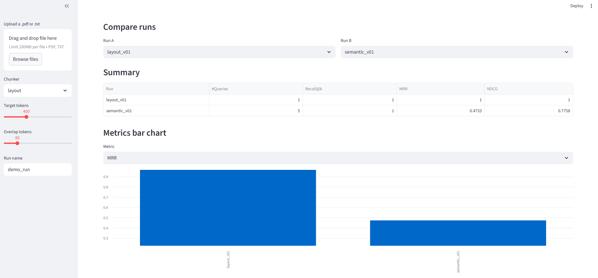
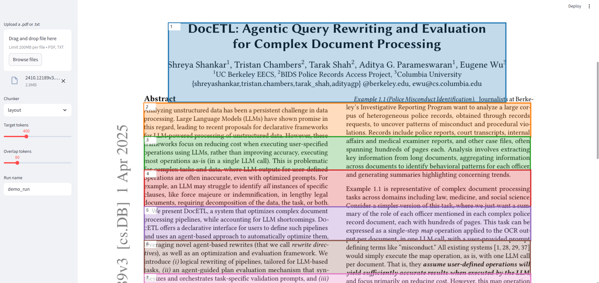

# ChunkViz

An open-source Python toolkit to **visualize, benchmark, and compare chunking strategies** for long documents in retrieval-augmented generation (RAG) pipelines.



## Install (editable)

```bash
pip install -e .
```

## Quickstart

```bash
# 1) Ingest text or PDFs (uses pdfplumber for text + bboxes)
chunkviz ingest data/samples --out data/parquet

# 2) Run a chunker (fixed, layout, or semantic)
chunkviz chunk --config data/configs/demo_layout.yaml --run-name layout_v01
chunkviz chunk --config data/configs/demo_semantic.yaml --run-name semantic_v01

# 3) Generate synthetic eval sets
python -m chunkviz.cli.app make-canary-hard layout_v01 --out data/canary_layout.jsonl --n 20
python -m chunkviz.cli.app make-canary-hard semantic_v01 --out data/canary_semantic.jsonl --n 20

# 4) Evaluate retrieval quality (Recall@k, MRR, NDCG)
chunkviz canary --run-name layout_v01 --queries data/canary_layout.jsonl --k 10 --backend hybrid
chunkviz canary --run-name semantic_v01 --queries data/canary_semantic.jsonl --k 10 --backend hybrid

# 5) Export HTML report
chunkviz report layout_v01
chunkviz report semantic_v01 --compare layout_v01

# 6) Launch visual UI
streamlit run apps/streamlit/App.py
```

## Features

* **Chunkers**:

  * Fixed (token-based)
  * Layout (PDF blocks, page structure)
  * Semantic (sentence embeddings + similarity merge)

* **Visualization**:

  * Overlay colored chunk boxes on PDF pages
  * Text previews + span highlights
  * Streamlit app with Overlay, Search, Compare tabs

* **Evaluation**:

  * Synthetic “canary” query sets
  * Metrics: Recall\@k, MRR, NDCG
  * Compare runs side-by-side in Streamlit or HTML report
  * Bar charts + summary KPIs

* **Retrieval backends**:

  * Lexical (BM25-like)
  * Embedding (SentenceTransformers)
  * Hybrid (linear fusion)

* **Reporting**:

  * HTML report with KPI summary, raw JSON, and thumbnails

## Why

Chunking is one of the biggest hidden levers in RAG performance. **ChunkViz makes it visible, measurable, and tunable.**

## License

MIT

